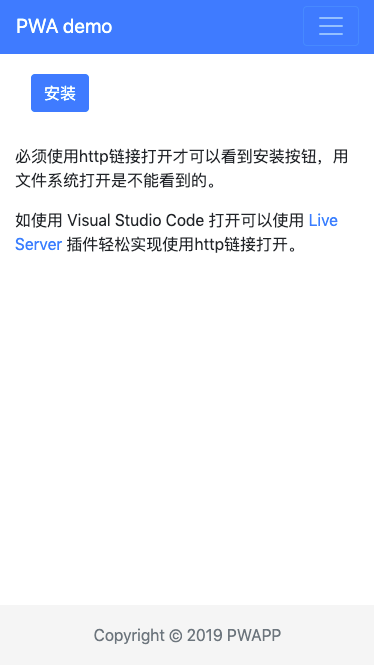
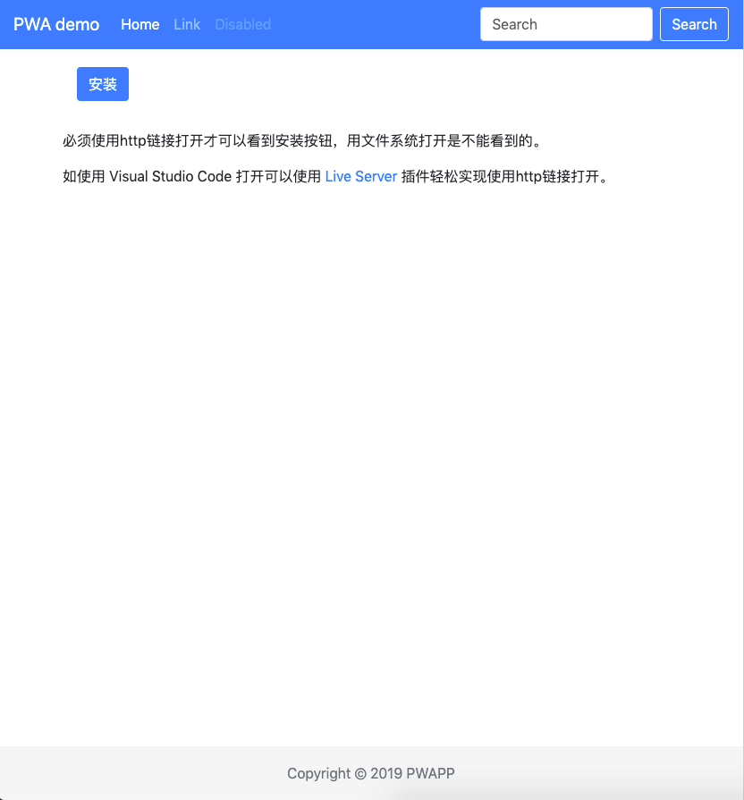

# PWA demo

PWA最简单例子。用最简单方法实现了多平台兼容的配置和离线缓存功能。

其中主要用到Google的2个库实现这些功能，分别为 [pwacompat][pwacompat] 实现多平台兼容的配置和 [workbox-sw][workbox-sw] 实现离线缓存功能。

由于代码比较简单，就不作详细解析了，直接看源码就可快速上手。

各位有PWA应用可发布到：[PWA集散地][pwapp]

## 预览

## Thanks For

- [pwacompat][pwacompat]
- [workbox-sw][workbox-sw]
- [PWA之 workbox 学习](https://segmentfault.com/a/1190000019281388)

[pwapp]: https://pwapp.net/
[pwacompat]: https://github.com/GoogleChromeLabs/pwacompat/
[workbox-sw]: https://github.com/GoogleChrome/workbox/
